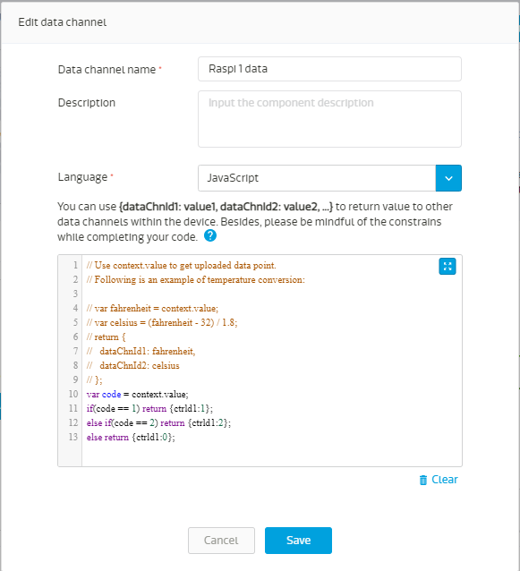
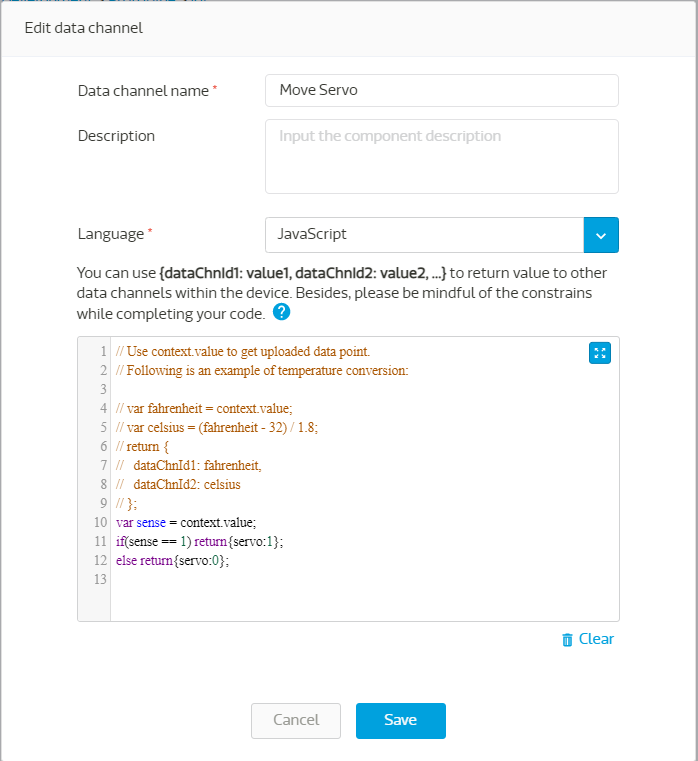
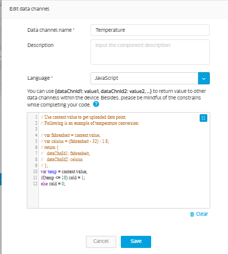
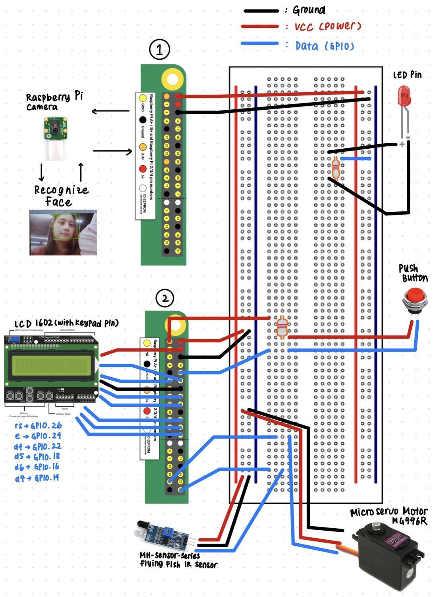
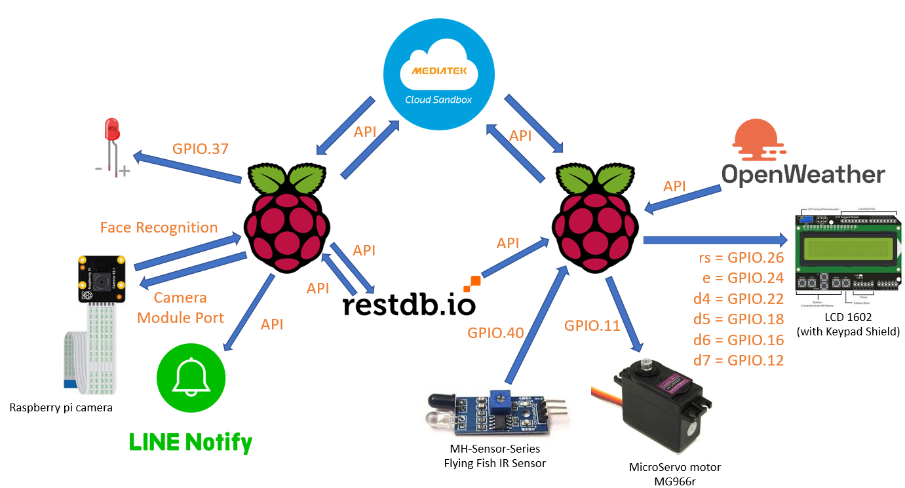

# Smart Closet - Internet of Things project

[Demo video](https://youtu.be/Q5LmcMkosqc)

### Objective

The objective of this project is to create a smart closet IoT system, with a face recognition system and a smart assistant which will let you know the weather conditions and recommend the best outfit to match the weather. Hopefully this project gives a basic idea about what smart closet could do in order to increase the convenience of the client.

### Hardware

#### Device

Raspberry Pi 2

#### Sensors

- Raspberry Pi Camera
- MH-Sensor-Series Flying Fish IR sensor
- Push button

#### Actuators

- MicroServo motor MG966R
- LCD 1602 (with keypad shield)
- LED pin

### System Design

The first raspberry pi is connected to the infrared sensor, push button, and the motor, and the second raspberry pi is connected to the camera. The system will first wait for a signal from either of the sensors (the IR sensor or the push button). When the IR sensor is triggered, the program will send a signal to MCS, instructing the other raspberry pi to execute face recognition on the person. When the system recognizes the person, it will send a signal back to MCS, instructing it to open the door, and via Line Notify send a notification about who has entered the room. However when the person is unknown, it will automatically send a snapshot of the intruder via Line Notify, and also instruct the other raspberry pi to close the door. When the push button is pressed, the program will send a signal to MCS, instructing the other raspberry pi to open the settings app, where the user can add/delete new faces.

In addition to that, we created the smart assistant system, where the second raspberry pi gets current weather information from `OpenWeather API`, and gets information about clothes in the closet from the `restdb.io` database. Using the information about the weather, it will send a signal to MCS which will instruct the LED connected to the first raspberry pi to turn on/off. On indicates the weather is cold, and off indicates the opposite. The second raspberry pi also functions as a connection to our clothes database, where the user can view, add, delete, organize their outfits. From this database too, the second raspberry pi will retrieve data about the clothes, and then recommend outfits that are suitable for the weather via the LCD display. Additionally, the user can also get information about date/time, weather predictions for the day from the display.

### System Flowchart

#### 1. First Raspberry Pi `main.py`

#### 2. Second Raspberry Pi `main.py`

#### 3. First Raspberry Pi `db-manager.py`

#### 4. Second Raspberry Pi `weather.py`

### Source Code Explanation

#### First Raspberry Pi

- `main.py`

  This is the main function for the second raspberry pi, where its job is to communicate with MCS, run GUI, and run other Python scripts for this project. First it will wait for a signal from MCS, where the values can either be `1` or `2`. `1` indicates a motion has been detected, thus provoking f`ace_recog.py` to open the camera and detect the face. When the script returns a `1`, it will send a signal back to MCS to open the door. The door will automatically close itself after 15 seconds. When it receives a `2`, it will open the settings, where a window will pop up with the options to add a new face or delete the face.

- `build_face_dataset.py`

  This is to build the dataset of the face that is authorized to open the door. It will open the pi camera and capture the face of the person when the `k` button is pressed.

- `encode_faces.py`

  This is to encode the images we have captured in the dataset, so it can be processed for facial recognition.

- `face_recog.py`

  This is the python script used to turn on the camera and use face recognition to authorize opening the door. When the face is authorized, it will send a notification using `line_notify.py` with a message stating the name of the person who just entered, and return a `1`. When the face is unauthorized, it will send a notification using `line_notify.py` a warning message and a snapshot of the intruder, and return 0.

- `line_notify.py`

  This is the python script that is used to send a message through line_notify. It is sourced from this [blog post](https://jkjung-avt.github.io/line-notify/).

  Example:

  
  

- `blink.py`

  Turn the LED pin on when the weather is cold. It is controlled by the `cold` data channel on MCS.

- `db-manager.py`

  Used to manage and do the operation to the online database `restdb.io`, which is get, post, and delete the content of the database stored inside `restdb.io`

#### Second raspberry pi

- `main.py`

  This function is the main controller for the second raspberry pi device, running this program will enable the scripts in this system to work. It starts by waiting for either the IF sensor to detect a motion, or for the button to be pushed. When a motion is detected, it will send a signal to the other Raspberry Pi device through MCS, to turn on the camera. Then it will wait for a response from the other device, which will decide whether the door can open or not. When a button is pressed, it will also send a signal to the other Raspberry Pi device through MCS, to open the settings app, where later the user can either add/delete face.

- `weather.py`

  This code has a few functions:

  1. `post_to_mcs`: this function is to post the signal to MCS. When it is predicted to rain, the main function will call this function and send a signal to the `Precipitation` data channel on the MCS cloud.
  2. `Get_current`: to request information about current weather to `OpenWeatherMap API`
  3. `Get_forecast`: to request forecast weather information from `OpenWeatherMap API`. (Currently using the data for the next 3 hours measured from the request time)
  4. `get_to_dbio`: retrieve the information about the clothes database
  5. `lcd_init`: initialize and clear display
  6. `lcd_write` & `lcd_toggle_enable`: configure the lcd display to write to the display and enable the operation
  7. `cd_text`: display the specified message onto the display
  8. `Setmain`: just a container to main function, to maintain the readability

  The main function starts by setting up the GPIO board and pins, and then first initializing the LCD display. Next, it will retrieve the current and forecast weather information by calling get_current and get_forecast function. It also calls the `get_to_dbio` function in order to get the information from the database, which contents are used to give recommendations on what outfit suits the current weather the most. After that, it will process the information retrieved from these functions and display the information afterwards.

#### MCS data channels

- Raspi 1 Controller (data channel id: `ctrl1`)

  In the code the variable `code` contains a signal sent from the second Raspberry pi device, `0` if nothing happened, `1` if the infrared sensor detects motion, and `2` if the button was pushed. The job of this code is to send the signal received to the `ctrld1` data channel, which is the data channel that controls the first raspberry pi device.

  Source code:

  

- Move Servo (data channel id: `move_servo`)

  In the code the variable `sense` contains a signal sent from the first Raspberry pi device (camera). `1` if face is authorized, and `0` if face is unknown. The job of this code is to send the signal received to the `servo` data channel, which is the data channel that controls the door.

  Source code:

  

- MicroServo Motor (data channel id `servo`)

  Switch controlled by `Move Servo` data channel.

- Raspi 1 Mode (data channel id: `ctrld1`)
  Switch controlled by `ctrl1` data channel. There are 3 categories here,

  1. `Idle` with value `0`, meaning the sensors didn’t detect anything,
  2. `Move` with value `1`, meaning the infrared sensor detects a motion and thus the face recognition program needs to launch,
  3. `Push` with value `2`, meaning that the button was pushed and settings need to be opened.

- Temperature (data channel id: `tempr`)

  It is a function data channel to control a data channel called `is cold?`. This function’s main purpose is to determine whether the detected temperature is cold or not. The variable temp is used to catch the temperature value sent by Raspberry Pi after getting information from `OpenWeatherMap API`. And it simply turn `cold = 1` if the temperature is below 18, else it will turn `cold = 0`

  Source code:

  

- is cold? (data channel id: `cold`)

  Switch controlled by `Temperature` data channel. Used to light up the led connected with the Raspberry Pi.

### Diagrams

#### Breadboard

#### System Architecture

